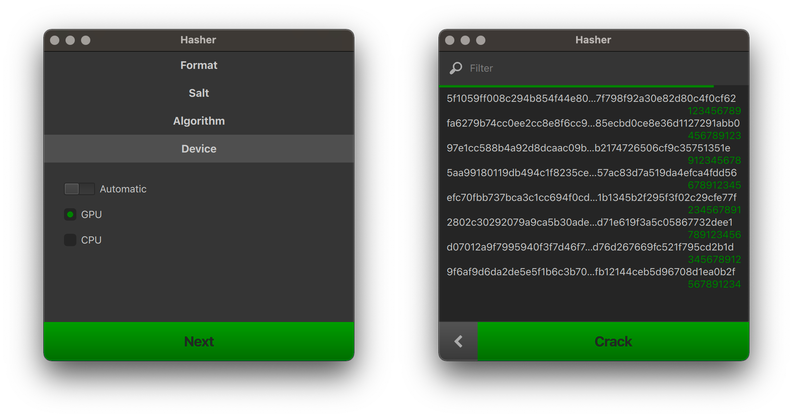

Hasher [](https://github.com/m-lima/hasher/actions?workflow=build)
========
#### A MD5 and Sha256 hasher / dehasher

## Building

### Depencies
- Rust
- OpenCL
- C++17 [optional]
- Qt6 [optional]

### Compiling
```bash
$ cd <this repository>
$ cargo build --release
```

### Creating bundles
This project can be bundled using [cargo bundle](https://github.com/burtonageo/cargo-bundle)
```bash
$ cargo install cargo-bundle
$ cd <this repository>
$ cargo bundle --release
```

Furthermore, if using feature `qml`, it is also possible to create a deployment

**Example on Mac**
```bash
$ macdeployqt ./target/release/bundle/Hasher.app -qmldir=./res/qml
```

### Features
|Name |Dependencies|
|-----|------------|
|`qml`|C++17, Qt6  |

## Running

#### GUI
With the feature flag `qml`, if no command line arguments are provided, the GUI will be launched


#### CLI
```
SHA256 hasher/cracker

USAGE:
    hasher <SUBCOMMAND>

FLAGS:
    -h, --help       Prints help information
    -V, --version    Prints version information

SUBCOMMANDS:
    crack    Crack hashes
    hash     Generate hashes
    help     Prints this message or the help of the given subcommand(s)

Input can be provided through stdin or as parameters
```

### Hash
```
Generate hashes

USAGE:
    hasher hash [FLAGS] [OPTIONS] [--] [input]...

ARGS:
    <input>...
            Values to hash

            If a single input is given, only the hash will be printed to stdout. If more than one
            input is given, the pairs <input>:<hash> will be printed to stdout, one per line

FLAGS:
    -n, --no-colors
            Disable colors

    -h, --help
            Prints help information

    -v
            Verbose mode (-v, -vv)

            All verboseness will be printed to stderr

    -V, --version
            Prints version information


OPTIONS:
    -a, --algorithm <algorithm>
            Algorithm to use [default: sha256] [possible values: md5, sha256]

    -s, --salt <salt>...
            Salt to prepend when generating hash [env: HASHER_SALT]
```

### Decrypt
```
Crack hashes

USAGE:
    hasher crack [FLAGS] [OPTIONS] [--] [input]...

ARGS:
    <input>...
            Hashed values to crack. Expected to be the hash of a numeric value

            If a single hash is given, only the cracked value will be printed to stdout. If more
            than one hash is given, the pairs <hash>:<cracked value> will be printed to stdout, one
            per line

FLAGS:
    -n, --no-colors
            Disable colors

    -h, --help
            Prints help information

    -v
            Verbose mode (-v, -vv)

            All verboseness will be printed to stderr

    -V, --version
            Prints version information


OPTIONS:
    -a, --algorithm <algorithm>
            Algorithm to use [default: sha256] [possible values: md5, sha256]

    -d, --device <device>
            Device to run in (auto-detection if omitted) [possible values: cpu, gpu]

    -f, --files <files>...
            Input files. Will be scanned for hashes to crack

            If any hash from a given file is cracked, a copy of the file will be created in the same
            directory with the ".cracked" extension containing all cracked hashes substituted in
            place

    -l, --length <length>
            Length of original values [default: 12]

    -p, --prefix <prefix>
            Known prefix of original values

    -s, --salt <salt>...
            Salt to prepend when generating hash [env: HASHER_SALT]

    -t, --threads <threads>
            Number of threads to spawn, automatic deduction if omitted

    -x, --xor <xor>...
            XOR mask to apply to plain values prior to hashing [env: HASHER_XOR]

            The mask is expected to be given as a base64 encoded representation


The cracker will exit with an error if any of the input hashes could not be cracked
```
